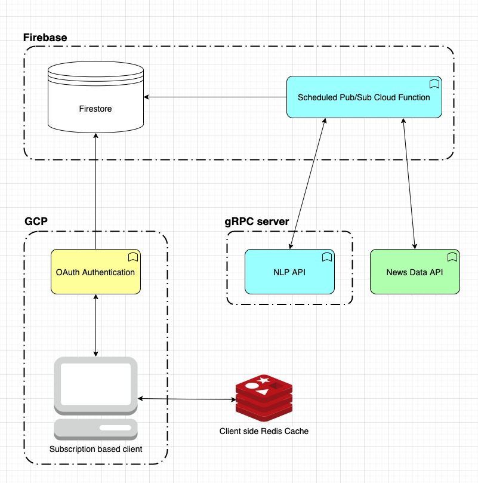

Pub-sub based service that allows users to subscribe to news archives from a multitude of sources

Project diagram:

Project structure:
- Scheduled pub/sub cloud functions with Firebase that saves the latest headlines every hour into Firestore
- Client side react SPA that subscribes to headlines from custom date ranges and news sources. Listens to changes in to the DB in realtime, updating the client view on any new headlines
- Local caching with Redis to save data already queried from firebase for previous days
- NLP API in Heroku hosted gRPC api using node. Provides sentiment analysis based on headline contents, and monthly summaries of global headliens
- OAuth and Guest login in with Firebase

Future ideas:
- Implement auth from scratch using Passport.js
- Dockerize and deploy on AWS or GCP
- Save user preferences and account info to provide a customized experience
- Add email-based subscription service to email weekly/monthly summaries with Sendgrid
